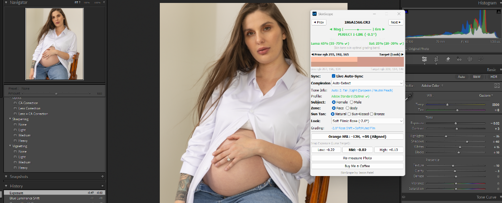
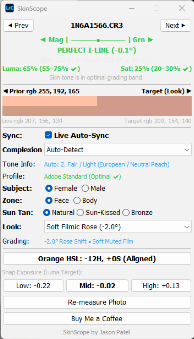

# SkinScope for Lightroom Classic

> **Objective Vectorscope Skin Tone Alignment & Luminance Balancing for Lightroom Classic**  
> Engineered by **Jason Patel** for portrait photographers and retouchers with color vision deficiencies (protanopia, deuteranopia, tritanopia).

---

  
   
  <em>SkinScope Real-time Floating HUD: Vectorscope I-Line alignment, Van Hurkman complexions, and split Before/After swatch.</em>

---

## 📸 Overview
Judging skin tones by eye is prone to eye fatigue, room ambient casts, and color vision deficiencies. 

**SkinScope** ports the industry-standard **DaVinci Resolve Vectorscope Skin Tone Line (I-Line)** and **Alexis Van Hurkman's *Color Correction Handbook*** skin tone metrics directly into Adobe Lightroom Classic as a real-time, 344px floating HUD.

---

## 🚀 Key Features

* **Universal I-Line Alignment**: Calculates vectorscope hue angle ($\theta$) in Rec.709 $YC_bC_r$ space and alerts you to magenta, yellow/green, or extreme white balance casts.
* **Alexis Van Hurkman Standards**: 8 plain-English complexion profiles (Porcelain, Fair, East Asian, Olive, Brown Light, Brown Medium, Brown Deep, Deep Melanin) with calibrated Luma and Saturation targets.
* **Exposure-Invariant Saturation**: Proprietary luma-normalized saturation formula eliminates false oversaturation warnings when adjusting exposure.
* **3-Way Exposure Snapping**: Dedicated Low, Mid, and High target buttons calculate exact logarithmic $\Delta\text{EV}$ photographic exposure shifts in one click.
* **⚡ Live Auto-Apply Sync**: Toggle live mode to automatically update Lightroom's Develop sliders in real time as you browse skin profiles and sun tans.
* **Seamless Split Swatch**: Borderless 344px Before/After swatch dynamically rendered in pure Lua.
* **Direct RAW Sampling**: Analyzes 2,000–5,000 raw skin pixels directly from camera preview metadata in $< 300\text{ms}$.

---

## 📁 Repository Structure

* [**`SPECIFICATION.md`**](file:///U:/%5BObsidian%5D/Home/IT/GitHub%20Projects/Lightroom-SkinScope/SPECIFICATION.md): Complete mathematical foundations, color science, solver algorithms, and decision log.
* [**`WINDOWS_SETUP.md`**](file:///U:/%5BObsidian%5D/Home/IT/GitHub%20Projects/Lightroom-SkinScope/WINDOWS_SETUP.md): Windows installation and development setup guide.
* [**`SkinScope.lrdevplugin/`**](file:///U:/%5BObsidian%5D/Home/IT/GitHub%20Projects/Lightroom-SkinScope/SkinScope.lrdevplugin): The active Lightroom Classic plugin bundle:
  * `SkinMath.lua`: ITU-R BT.709 color science, complexion matrix, binary search solvers, BMP generator.
  * `SkinScopeDialog.lua`: Floating HUD UI, live sync engine, event loop, property bindings.
  * `SkinScopePlugin.lua`: Lightroom Classic plugin entry point.
  * `sample_photo.py`: RAW preview skin pixel extractor.
  * `comparison.html`: Visual Split Viewer.
  * `Info.lua`: Plugin manifest.
* [**`tools/test_skin_math.py`**](file:///U:/%5BObsidian%5D/Home/IT/GitHub%20Projects/Lightroom-SkinScope/tools/test_skin_math.py): Mathematical test suite.

---

## ☕ Support the Project
If SkinScope helps your photography workflow, you can support development via [Buy Me a Coffee](https://buymeacoffee.com/jasonpatel).
