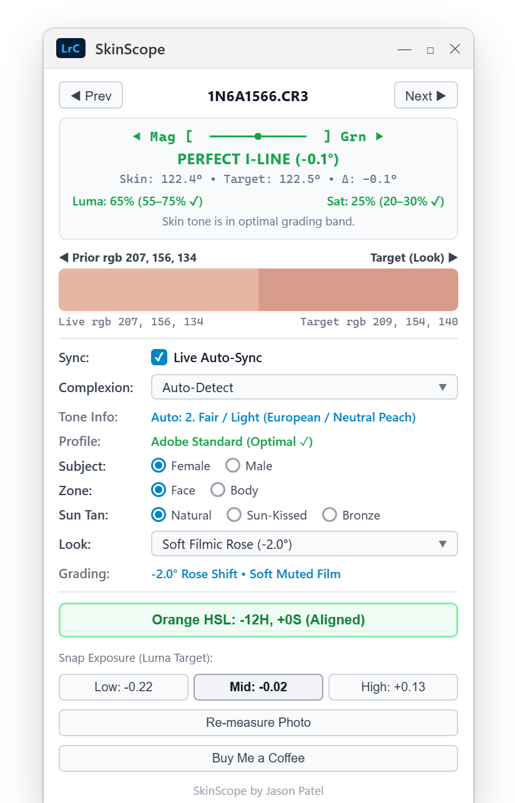

# SkinScope for Lightroom Classic

> **Objective Vectorscope Skin Tone Alignment & Luminance Balancing for Lightroom Classic**  
> Engineered by **Jason Patel** for portrait photographers and retouchers with color vision deficiencies (protanopia, deuteranopia, tritanopia).

---

  
   
  <em>SkinScope Real-time Floating HUD: Vectorscope I-Line alignment, Van Hurkman complexions, and continuous Before/After swatch.</em>

---

## 📸 Overview
Judging skin tones by eye is prone to eye fatigue, room ambient casts, and color vision deficiencies. 

**SkinScope** ports the industry-standard **DaVinci Resolve Vectorscope Skin Tone Line (I-Line)** and **Alexis Van Hurkman's *Color Correction Handbook*** skin tone metrics directly into Adobe Lightroom Classic as a real-time, 344px floating HUD.

---

## 🚀 Key Features

* **Universal I-Line Alignment**: Calculates vectorscope hue angle ($\theta$) in Rec.709 $YC_bC_r$ space and alerts you to magenta, yellow/green, or extreme white balance casts.
* **Alexis Van Hurkman Standards**: 8 plain-English complexion profiles (Porcelain, Fair, East Asian, Olive, Brown Light, Brown Medium, Brown Deep, Deep Melanin) with calibrated Luma and Saturation targets.
* **Exposure-Invariant Saturation**: Proprietary luma-normalized saturation formula eliminates false oversaturation warnings when adjusting exposure.
* **3-Way Exposure Snapping**: Dedicated Low, Mid, and High target buttons calculate exact logarithmic $\Delta\text{EV}$ photographic exposure shifts in one click.
* **⚡ Live Auto-Apply Sync**: Toggle live mode to automatically update Lightroom's Develop sliders in real time as you browse skin profiles and sun tans.
* **Seamless Split Swatch**: Borderless 344px Before/After swatch dynamically rendered in pure Lua.
* **Direct RAW Sampling**: Analyzes 2,000–5,000 raw skin pixels directly from camera preview metadata in $< 300\text{ms}$.

---

## 📥 Download & Installation

### 1. Download the Plugin
* 👉 [**Download Latest Release (SkinScope-v1.0.zip)**](https://github.com/jasonpatel/Lightroom-SkinScope/releases/latest)
* Extract the `.zip` archive on your computer. You will find a folder named **`SkinScope.lrplugin`**.  
  *(Recommended: Keep this folder in a permanent location like `Documents/Lightroom Plugins/`)*.

---

### 2. Add to Adobe Lightroom Classic
1. Open **Adobe Lightroom Classic**.
2. Go to the top menu bar: **File** → **Plug-in Manager...**
3. In the bottom-left corner of the dialog, click the **Add** button.
4. Browse to the folder where you extracted the plugin, select the **`SkinScope.lrplugin`** folder, and click **Select Folder** (Windows) or **Add Plug-in** (Mac).
5. The status indicator next to **SkinScope** will show a green circle (`Installed and running`). Click **Done**.

---

### 🎯 How to Use

1. Switch to Lightroom's **Develop** module (press `D`) and select any portrait.
2. Open the SkinScope floating HUD:
   * **Windows shortcut**: <kbd>Ctrl</kbd> + <kbd>Alt</kbd> + <kbd>Shift</kbd> + <kbd>S</kbd>
   * **Mac shortcut**: <kbd>Cmd</kbd> + <kbd>Opt</kbd> + <kbd>Shift</kbd> + <kbd>S</kbd>
   * *(Or via menu: **Help** → **Plug-in Extras** → **SkinScope**)*
3. The real-time 344px floating HUD opens alongside your photo:
   * **Complexion Profile**: Auto-Detect reads the skin tone, or select from 8 Van Hurkman calibrated profiles.
   * **Live Auto-Sync**: Check `Live Auto-Sync` to automatically sync Develop sliders in real time as you browse profiles.
   * **1-Click Orange HSL Snap**: Click the prominent **`Orange HSL: [Δ] (Align)`** button to immediately align skin tones to the Rec.709 Vectorscope I-Line.
   * **Exposure Snapping**: Click **Low**, **Mid**, or **High** to snap exposure to exact Van Hurkman luminance targets.

---

## 📁 Repository Structure

* [**`SPECIFICATION.md`**](file:///U:/%5BObsidian%5D/Home/IT/GitHub%20Projects/Lightroom-SkinScope/SPECIFICATION.md): Complete mathematical foundations, color science, solver algorithms, and decision log.
* [**`WINDOWS_SETUP.md`**](file:///U:/%5BObsidian%5D/Home/IT/GitHub%20Projects/Lightroom-SkinScope/WINDOWS_SETUP.md): Windows installation and development setup guide.
* [**`SkinScope.lrdevplugin/`**](file:///U:/%5BObsidian%5D/Home/IT/GitHub%20Projects/Lightroom-SkinScope/SkinScope.lrdevplugin): The active Lightroom Classic plugin bundle:
  * `SkinMath.lua`: ITU-R BT.709 color science, complexion matrix, binary search solvers, BMP generator.
  * `SkinScopeDialog.lua`: Floating HUD UI, live sync engine, event loop, property bindings.
  * `SkinScopePlugin.lua`: Lightroom Classic plugin entry point.
  * `sample_photo.py`: RAW preview skin pixel extractor.
  * `comparison.html`: Visual Split Viewer.
  * `Info.lua`: Plugin manifest.
* [**`tools/test_skin_math.py`**](file:///U:/%5BObsidian%5D/Home/IT/GitHub%20Projects/Lightroom-SkinScope/tools/test_skin_math.py): Mathematical test suite.

---

## ☕ Support the Project
If SkinScope helps your photography workflow, you can support development via [Buy Me a Coffee](https://buymeacoffee.com/jasonpatel).
